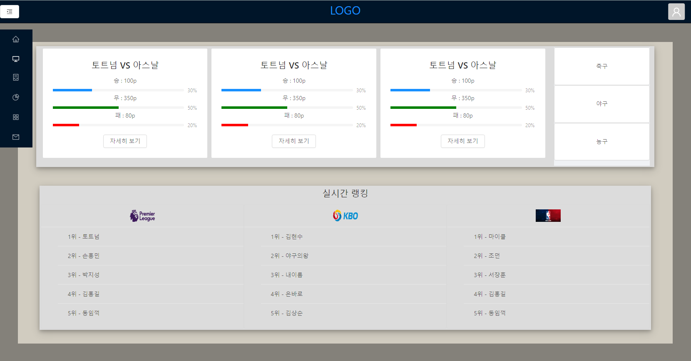

# 스포츠도도!

 

  승부를 예측하고 포인트를 얻으세요!    
  ( Match results and Get points!)

 

  <a href="#usage">Usage</a> •
  <a href="#boast-puppy">Batting</a> •
  <a href="#random-dog">Ranking</a> •
  <a href="#author">Author</a> •
  <a href="#license">License</a>

 

  
## Usage

<code>$ git clone ~</code>

## Key-Features

- 승부를 예측하고 포인트를 얻어 1등에 도전하세요!
- 실시간으로 반영되는 매치 리스트!
- 포인트로 다양한 혜택을 받으세요 (업데이트 예정)

## Batting

## Ranking

## Author

[ehgks0000](https://github.com/ehgks0000)

[moongq](https://github.com/moongq)

[SeoSang](https://github.com/SeoSang)
- Blog : programming119.tistory.com
- E-mail : ddrrpg@naver.com

[PaaD](https://github.com/Wearenotyourkind)
- E-mail : quintuplets2000@gmail.com

## License

MIT

## 기획 문서
https://drive.google.com/file/d/1djAq96OK2dg25243VXGaq7UZmO_cd72i/view?usp=sharing
