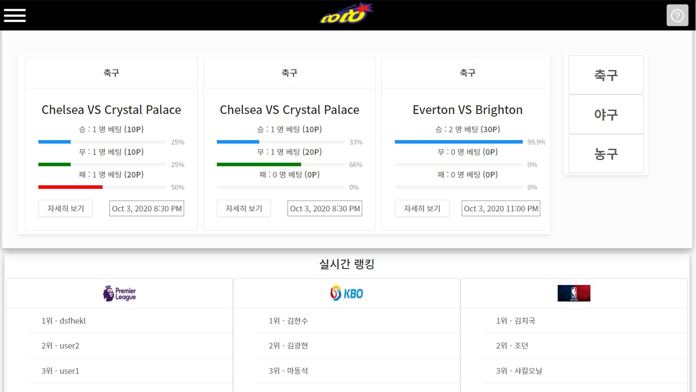
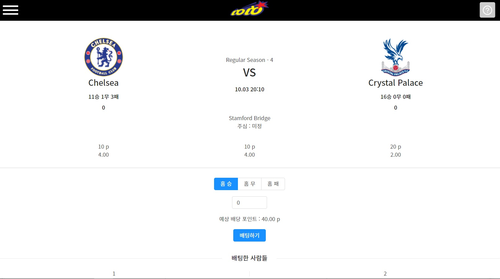

# Sports-DoDo!

 

  승부를 예측하고 포인트를 얻으세요!    
  ( Match results and Get points!)

 

  <a href="#key-features">Key-Features</a> •
  <a href="#tech-used">Tech-Used</a> •
  <a href="#author">Author</a> •
  <a href="#license">License</a>

 

---

## Key-Features

- 승부를 예측하고 포인트를 얻어 1등에 도전하세요!
- 실시간으로 반영되는 매치 리스트!
- 포인트로 다양한 혜택을 받으세요 (업데이트 예정)

---

### 베팅하세요!

## Tech-Used
 

### Backend
  - Architecture : Node js & Express
  - DB : Mongo DB
  - Testing : Mocha, chai

### Frontend
  - Architecture : React & Next JS
  - State Management : Redux & immer, Redux-saga
  - Design : Antd, styled-component

### ETC
  - Sports API Connection
  - Real-Time Updated Data by Scheduling
  - JWT Authentication 
  - Global-State management

---
## Author

[ehgks0000](https://github.com/ehgks0000)

[moongq](https://github.com/moongq)

[SeoSang](https://github.com/SeoSang)
- Blog : programming119.tistory.com
- E-mail : ddrrpg@naver.com

[PaaD](https://github.com/Wearenotyourkind)
- E-mail : quintuplets2000@gmail.com

## License

MIT

## 기획 문서
https://drive.google.com/file/d/1djAq96OK2dg25243VXGaq7UZmO_cd72i/view?usp=sharing
